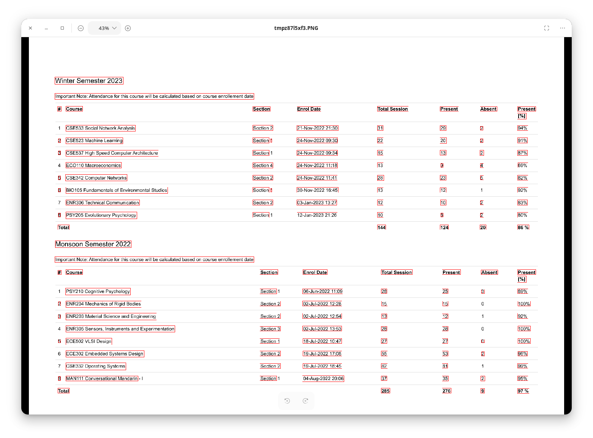

# Course Extractor
This script is used to extract text, and analyse from attendance sheets of students. 

### Working
The script renders PDF to a python image in memory, then uses OCR to extract text from the flattened image.
The extracted text is in form of list with coordinates of bounding boxes. Then the bounding boxes are sorted from top to bottom.
The sorted text is then interpreted, headings in the PDF like semester names are pre-defined, and courses are matched from a python set of non-compulsory courses.

### Usage
As the script requires multiple input directories, the directories are listed in the beginning of the python file [index.py](scripts/index.py).
After collecting PDFs to analyse, store them in a directory. 

#### Screenshot of OCR in a sample

